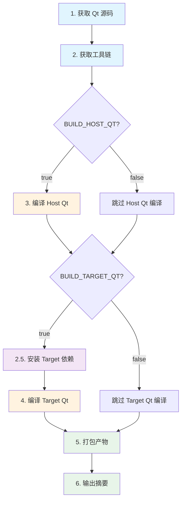

# 构建流程详解

本文档详细介绍 Qt 交叉编译管道的完整构建流程，包括各阶段的输入输出、执行顺序和幂等性说明。

## 目录

- [流程概览](#流程概览)
- [阶段详解](#阶段详解)
- [幂等性说明](#幂等性说明)
- [故障排查](#故障排查)

## 流程概览

构建流程分为 7 个阶段，按顺序执行：



### 执行入口

主入口脚本为 `build.sh`，它依次调用各阶段脚本：

```bash
#!/usr/bin/env bash
bash build.sh
```

## 阶段详解

### 阶段 1：获取 Qt 源码

**脚本**: `scripts/00-fetch-qt-src.sh`

**功能**: 下载并解压 Qt 源码压缩包

**输入**:
- `QT_SRC_URL`: Qt 源码下载地址（来自 `config/qt.conf`）
- `QT_VERSION`: Qt 版本号
- `WORK_DIR`: 工作目录

**输出**:
- `${WORK_DIR}/src/${QT_SRC_DIR}/`: 解压后的 Qt 源码目录
- `${WORK_DIR}/src/qt-everywhere-src-${QT_VERSION}.tar.xz`: 源码压缩包

**关键操作**:
```bash
# 下载源码（支持断点续传和重试）
download_file "$QT_SRC_URL" "$ARCHIVE_PATH"

# 解压源码
extract_archive "$ARCHIVE_PATH" "$SRC_DIR"

# 验证完整性（检查 CMakeLists.txt）
```

**幂等性**: 已存在完整的源码目录时自动跳过

---

### 阶段 2：获取工具链

**脚本**: `scripts/01-fetch-toolchain.sh`

**功能**: 验证或下载交叉编译工具链

**输入**:
- `TOOLCHAIN_URL`: 工具链下载地址（可选，为空则使用本地工具链）
- `TOOLCHAIN_ROOT`: 工具链根目录
- `TOOLCHAIN_PREFIX`: 工具链前缀（如 `arm-none-linux-gnueabihf-`）

**输出**:
- `${TOOLCHAIN_ROOT}/`: 工具链安装目录
- 自动检测的 `TOOLCHAIN_BIN_DIR`: 工具链 bin 目录

**关键操作**:
```bash
# 情况 A: 使用本地工具链
if [[ -z "${TOOLCHAIN_URL}" ]]; then
    # 验证本地工具链存在
    # 自动检测 bin 目录
    TOOLCHAIN_BIN_DIR=$(auto_detect_toolchain_bin "${TOOLCHAIN_ROOT}" "${TOOLCHAIN_PREFIX}")
fi

# 情况 B: 下载工具链
if [[ -n "${TOOLCHAIN_URL}" ]]; then
    download_file "${TOOLCHAIN_URL}" "${ARCHIVE_PATH}"
    tar -xJf "$ARCHIVE_PATH" --strip-components=1 -C "${TOOLCHAIN_ROOT}"
fi

# 验证工具链
${TOOLCHAIN_BIN_DIR}/${TOOLCHAIN_PREFIX}gcc --version
```

**幂等性**: 工具链已存在且验证通过时跳过下载

---

### 阶段 3：编译 Host Qt

**脚本**: `scripts/02-build-host-qt.sh`

**功能**: 编译并安装主机版本的 Qt（用于交叉编译时的辅助工具）

**输入**:
- Qt 源码目录（阶段 1 输出）
- `HOST_INSTALL_PREFIX`: Host Qt 安装路径
- `QT_MODULES`: 要编译的模块列表
- `HOST_CONFIGURE_EXTRA`: 额外的 configure 参数

**输出**:
- `${HOST_INSTALL_PREFIX}/`: Host Qt 安装目录
  - `bin/qmake`: qmake 可执行文件
  - `bin/qtpaths`: qtpaths 工具
  - `lib/`: 主机端库文件
  - `plugins/`: 主机端插件

**关键操作**:
```bash
# 准备构建目录
BUILD_DIR="${WORK_DIR}/build-host"
rm -rf "${BUILD_DIR}"
mkdir -p "${BUILD_DIR}"

# 配置 Qt
cd "${BUILD_DIR}"
"${SRC_DIR}/configure" \
    -prefix "${HOST_INSTALL_PREFIX}" \
    -submodules "${QT_MODULES}" \
    -release \
    -nomake examples -nomake tests \
    ${HOST_CONFIGURE_EXTRA}

# 编译（使用多核加速）
cmake --build . --parallel "${PARALLEL_JOBS}"

# 安装
cmake --install .
```

**幂等性**: 检测到 `${HOST_INSTALL_PREFIX}/bin/qmake` 存在时自动跳过

**依赖条件**:
- `BUILD_HOST_QT=true` 时执行
- 必需命令: `cmake`, `ninja`, `perl`

---

### 阶段 2.5：安装 Target 依赖

**脚本**: `scripts/install_target_deps.sh`

**功能**: 安装目标平台所需的依赖库（ALSA、PulseAudio、FFmpeg 等）

**输入**:
- `TARGET_ARCH`: 目标架构（armhf/arm64）
- 依赖库配置（来自 `config/third_party.conf`）

**输出**:
- `${WORK_DIR}/third-party-sysroot/`: 第三方库 sysroot
  - `usr/include/`: 头文件
  - `usr/lib/`: 库文件
- 自动生成对应的 CMake 配置

**关键操作**:
```bash
# 委托给 third_party 管理器
exec bash "${SCRIPT_DIR}/third_party/manager.sh" install

# 各库的安装脚本位于:
# scripts/third_party/alsa/builtin.sh
# scripts/third_party/pulseaudio/builtin.sh
# scripts/third_party/ffmpeg/builtin.sh
# scripts/third_party/openssl/builtin.sh
```

**支持的依赖库**:
- ALSA: 音频支持
- PulseAudio: 音频后端
- FFmpeg: 多媒体解码
- OpenSSL: SSL/TLS 支持
- tsilb: 触摸屏校准

**幂等性**: 已安装的库会自动跳过

---

### 阶段 4：编译 Target Qt

**脚本**: `scripts/03-build-target-qt.sh`

**功能**: 交叉编译目标平台的 Qt

**输入**:
- Qt 源码目录（阶段 1）
- Host Qt 安装目录（阶段 3，必需）
- 工具链配置（阶段 2）
- Target 依赖库（阶段 2.5）

**输出**:
- `${TARGET_INSTALL_PREFIX}/`: Target Qt 安装目录（staging）
  - `bin/qmake`: 交叉编译 qmake
  - `bin/qt-cmake`: 交叉编译 cmake 包装器
  - `lib/`: 目标平台库文件
  - `plugins/`: 目标平台插件

**关键操作**:
```bash
# 生成 CMake 工具链文件
sed -e "s|@TARGET_OS@|${TARGET_OS}|g" \
    -e "s|@TOOLCHAIN_BIN_DIR@|${TOOLCHAIN_BIN_DIR}|g" \
    "${SCRIPT_DIR}/../cmake/cross-toolchain.cmake.in" > "${TOOLCHAIN_FILE}"

# 添加第三方库配置
cmake_fragment=$("${SCRIPT_DIR}/third_party/manager.sh" generate-cmake)
echo "$cmake_fragment" >> "${TOOLCHAIN_FILE}"

# 配置 Qt（交叉编译模式）
cd "${BUILD_DIR}"
"${CONFIGURE_SCRIPT}" \
    -release \
    -qt-host-path "${HOST_QT_DIR}" \
    -extprefix "${INSTALL_PREFIX}" \
    -prefix "${DEVICE_PREFIX}" \
    -submodules "${QT_MODULES}" \
    -nomake examples -nomake tests \
    ${TARGET_CONFIGURE_EXTRA} \
    -- \
    -DCMAKE_TOOLCHAIN_FILE="${TOOLCHAIN_FILE}" \
    ${TARGET_RENDER_BACKENDS} \
    ${TARGET_CMAKE_EXTRA}

# 编译
cmake --build . --parallel "${PARALLEL_JOBS}"

# 安装
cmake --install .
```

**幂等性**: 检测到 `${TARGET_INSTALL_PREFIX}/bin/qmake` 存在时自动跳过

**依赖条件**:
- `BUILD_TARGET_QT=true` 时执行
- 必须先完成 Host Qt 编译

---

### 阶段 5：打包产物

**脚本**: `scripts/04-package.sh`

**功能**: 将编译好的 Qt 打包为 `.tar.xz` 压缩包

**输入**:
- `${HOST_INSTALL_PREFIX}/`: Host Qt 安装目录（如果已编译）
- `${TARGET_INSTALL_PREFIX}/`: Target Qt 安装目录（如果已编译）

**输出**:
- `${WORK_DIR}/artifacts/`: 打包产物目录
  - `qt6-host-${QT_VERSION}-linux-x86_64.tar.xz`: Host Qt 打包文件
  - `qt6-target-${QT_VERSION}-${TARGET_ARCH}-${PLATFORM_ID}.tar.xz`: Target Qt 打包文件
  - `*.sha256`: 对应的 SHA256 校验和文件

**关键操作**:
```bash
# 打包 Host Qt
tar -cJf "${HOST_ARCHIVE}" \
    -C "$(dirname "${HOST_INSTALL_PREFIX}")" \
    "$(basename "${HOST_INSTALL_PREFIX}")"

# 生成校验和
sha256sum "$(basename "${HOST_ARCHIVE}")" > "$(basename "${HOST_ARCHIVE}").sha256"

# 打包 Target Qt（同样流程）
tar -cJf "${TARGET_ARCHIVE}" \
    -C "$(dirname "${TARGET_INSTALL_PREFIX}")" \
    "$(basename "${TARGET_INSTALL_PREFIX}")"
```

**幂等性**: 已存在的打包文件和校验和会被保留

---

### 阶段 6：输出摘要

**功能**: 显示构建结果摘要

**输出信息**:
```bash
Installation Paths:
  Host Qt:   ${WORK_DIR}/qt6-host
  Target Qt: ${WORK_DIR}/qt6-imx6ull

Generated Packages:
  qt6-host-6.9.1-linux-x86_64.tar.xz (256 MB)
  qt6-target-6.9.1-armhf-linux-arm-gnueabihf.tar.xz (128 MB)

To use the compiled Qt in your project:
  cmake -DCMAKE_PREFIX_PATH=<installation_path> ..
```

## 幂等性说明

整个构建管道设计为幂等的，可以安全地重复执行：

| 阶段 | 幂等性检查 | 跳过条件 |
|------|-----------|---------|
| 获取源码 | 检查 `CMakeLists.txt` 存在 | 源码目录完整 |
| 获取工具链 | 验证 gcc 可执行 | 工具链已安装 |
| 编译 Host Qt | 检查 `bin/qmake` 存在 | 已安装 |
| 安装依赖 | 各库独立检查 | 已安装的库跳过 |
| 编译 Target Qt | 检查 `bin/qmake` 存在 | 已安装 |
| 打包产物 | 检查 `.tar.xz` 和 `.sha256` | 已打包 |

### 重新构建

如需强制重新构建某个阶段：

```bash
# 重新编译 Host Qt
rm -rf "${WORK_DIR}/build-host" "${WORK_DIR}/qt6-host"
bash scripts/02-build-host-qt.sh

# 重新编译 Target Qt
rm -rf "${WORK_DIR}/build-target" "${WORK_DIR}/qt6-imx6ull"
bash scripts/03-build-target-qt.sh

# 重新打包
rm -f "${WORK_DIR}/artifacts"/*.tar.xz
bash scripts/04-package.sh
```

## 故障排查

### 常见问题

**1. 源码下载失败**
```bash
# 检查网络连接
ping -c 3 download.qt.io

# 使用国内镜像（修改 config/qt.conf）
QT_SRC_URL="https://mirrors.ustc.edu.cn/qtproject/archive/qt/6.9/6.9.1/single/qt-everywhere-src-6.9.1.tar.xz"
```

**2. Host Qt 编译失败**
```bash
# 检查依赖
bash scripts/install-host-deps.sh

# 清理重建
rm -rf "${WORK_DIR}/build-host"
bash scripts/02-build-host-qt.sh
```

**3. Target Qt 配置失败**
```bash
# 检查工具链
${TOOLCHAIN_BIN_DIR}/${TOOLCHAIN_PREFIX}gcc --version

# 检查 Host Qt
ls "${HOST_INSTALL_PREFIX}/bin/qmake"

# 查看详细配置日志
cd "${WORK_DIR}/build-target"
../src/qt-everywhere-src-*/configure --help
```

**4. 找不到第三方库**
```bash
# 检查 sysroot
ls "${WORK_DIR}/third-party-sysroot/usr/lib/"

# 重新安装依赖
rm -rf "${WORK_DIR}/third-party-sysroot"
bash scripts/install_target_deps.sh
```

### 调试技巧

1. **查看配置日志**
   ```bash
   # Host Qt
   cat "${WORK_DIR}/build-host/CMakeFiles/CMakeOutput.log"

   # Target Qt
   cat "${WORK_DIR}/build-target/CMakeFiles/CMakeOutput.log"
   ```

2. **检查工具链文件**
   ```bash
   cat "${WORK_DIR}/cross-toolchain.cmake"
   ```

3. **验证安装**
   ```bash
   # Host Qt
   "${HOST_INSTALL_PREFIX}/bin/qmake" -v

   # Target Qt（显示交叉编译信息）
   "${TARGET_INSTALL_PREFIX}/bin/qmake" -v
   ```

## 相关文档

- [配置文件说明](../04-配置文件/)
- [常用参数](./常用参数.md)
- [第三方库管理](../06-第三方库/)
