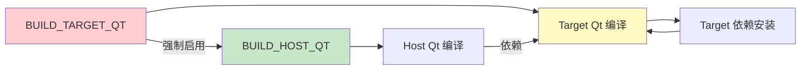

# 构建脚本参数

本文档介绍 Qt 编译管道中可用的环境变量、配置变量以及常用构建场景。

## 目录

- [环境变量](#环境变量)
- [配置变量](#配置变量)
- [常用构建场景](#常用构建场景)
- [部分构建](#部分构建)
- [重新构建](#重新构建)

## 环境变量

### PARALLEL_JOBS

控制编译时的并行任务数，默认使用 CPU 核心数。

```bash
# 使用默认值（CPU 核心数）
./build.sh

# 指定并行任务数
PARALLEL_JOBS=4 ./build.sh

# 单线程编译（调试用）
PARALLEL_JOBS=1 ./build.sh
```

**适用场景**:
- 高配服务器: `PARALLEL_JOBS=16` 或更高
- 低配机器: `PARALLEL_JOBS=2` 或 `PARALLEL_JOBS=1`
- 内存不足时减少并行数

### UBUNTU_VERSION

控制下载 ARM 依赖包时使用的 Ubuntu 版本。

```bash
# 使用默认值 (jammy/22.04)
./build.sh

# 指定其他版本
UBUNTU_VERSION=focal ./build.sh  # Ubuntu 20.04
```

**注意**: `noble` (24.04) 不支持 `armhf` 架构，交叉编译 ARMv7 时需使用 `jammy`。

### UBUNTU_MIRROR

Ubuntu 包镜像地址。

```bash
# 使用默认镜像
./build.sh

# 使用国内镜像
UBUNTU_MIRROR=https://mirrors.ustc.edu.cn/ubuntu-ports/ ./build.sh
```

## 配置变量

配置变量定义在 `config/` 目录下的配置文件中。

### BUILD_HOST_QT

是否编译主机版本 Qt。

**文件**: `config/qt.conf`

```bash
# 编译 Host Qt（默认）
BUILD_HOST_QT=true

# 跳过 Host Qt 编译
BUILD_HOST_QT=false
```

**注意**: 当 `BUILD_TARGET_QT=true` 时，会自动启用 `BUILD_HOST_QT`。

### BUILD_TARGET_QT

是否编译目标平台版本 Qt（交叉编译）。

**文件**: `config/qt.conf`

```bash
# 同时编译 Host 和 Target Qt（默认）
BUILD_TARGET_QT=true

# 仅编译 Host Qt
BUILD_TARGET_QT=false
```

### QT_MODULES

指定要编译的 Qt 模块。

**文件**: `config/qt.conf`

```bash
# 默认模块列表
QT_MODULES="qtbase qtdeclarative qtmultimedia qtcharts qtshadertools qtserialport qtvirtualkeyboard qt5compat"
```

**可用模块**:

| 模块 | 说明 | 推荐场景 |
|------|------|---------|
| qtbase | 核心模块（必需） | 所有场景 |
| qtdeclarative | QML/Quick 支持 | 现代界面 |
| qtmultimedia | 多媒体支持 | 音视频播放 |
| qtcharts | 图表组件 | 数据可视化 |
| qtshadertools | 着色器工具 | 图形渲染 |
| qtserialport | 串口通信 | 硬件通信 |
| qtvirtualkeyboard | 虚拟键盘 | 触摸屏设备 |
| qt5compat | Qt 5 兼容层 | 迁移项目 |
| qtimageformats | 额外图像格式 | 特殊格式支持 |
| qtlottie | Lottie 动画 | 动画效果 |

**精简示例**:
```bash
# 最小化配置（仅核心模块）
QT_MODULES="qtbase"

# 典型嵌入式配置
QT_MODULES="qtbase qtdeclarative qtsensors qtserialport"
```

### QT_VERSION

Qt 版本号。

**文件**: `config/qt.conf`

```bash
# 修改 Qt 版本
QT_VERSION="6.9.1"
QT_SRC_URL="https://download.qt.io/official_releases/qt/6.9/6.9.1/single/qt-everywhere-src-${QT_VERSION}.tar.xz"
QT_SRC_DIR="qt-everywhere-src-${QT_VERSION}"
```

### TARGET_ARCH

目标平台架构。

**文件**: `config/target.conf`

```bash
# ARMv7-A (如 i.MX6ULL)
TARGET_ARCH="armhf"

# ARMv8-A 64位
TARGET_ARCH="arm64"
```

### HOST_INSTALL_PREFIX

Host Qt 安装路径。

**文件**: `config/host.conf`

```bash
# 默认路径
HOST_INSTALL_PREFIX="${WORK_DIR}/qt6-host"

# 自定义路径
HOST_INSTALL_PREFIX="/opt/qt6-host"
```

### TARGET_INSTALL_PREFIX

Target Qt 本地安装路径（staging 目录）。

**文件**: `config/target.conf`

```bash
# 默认路径
TARGET_INSTALL_PREFIX="${WORK_DIR}/qt6-imx6ull"

# 自定义路径
TARGET_INSTALL_PREFIX="/opt/qt6-imx6ull"
```

### TARGET_DEVICE_PREFIX

Target Qt 在目标设备上的实际路径。

**文件**: `config/target.conf`

```bash
# 设备上的固定路径
TARGET_DEVICE_PREFIX="/usr/local/qt6"

# 或其他位置
TARGET_DEVICE_PREFIX="/opt/qt6"
```

**注意**: 修改此值后需要重新编译 Target Qt。

### TARGET_RENDER_BACKENDS

渲染后端配置。

**文件**: `config/target.conf`

```bash
# 默认配置（Linux Framebuffer）
TARGET_RENDER_BACKENDS="\
  -DFEATURE_xcb=OFF \
  -DFEATURE_eglfs=OFF \
  -DFEATURE_linuxfb=ON \
  -DFEATURE_evdev=ON \
  -DFEATURE_tslib=ON \
"
```

**渲染后端对照表**:

| 后端 | 适用场景 | 配置 |
|------|---------|------|
| linuxfb | 裸 Framebuffer | `FEATURE_linuxfb=ON` |
| eglfs | EGL + GPU (直接渲染) | `FEATURE_eglfs=ON` |
| xcb | X11 桌面 | `FEATURE_xcb=ON` |
| wayland | Wayland 合成器 | `FEATURE_wayland=ON` |

### HOST_CONFIGURE_EXTRA

Host Qt 额外的 configure 参数。

**文件**: `config/host.conf`

```bash
# 默认配置
HOST_CONFIGURE_EXTRA="\
  -optimize-size \
  -DFEATURE_sql=OFF \
  -DFEATURE_boringssl=OFF \
  -DFEATURE_openssl=OFF \
"
```

**常用参数**:

```bash
# 启用 SQL 支持
-DFEATURE_sql=ON

# 启用网络支持
-DFEATURE_network=ON

# 启用打印支持
-DFEATURE_printsupport=ON

# 优化体积
-optimize-size

# 优化速度
-optimize-speed
```

### TARGET_CONFIGURE_EXTRA

Target Qt 额外的 configure 参数。

**文件**: `config/target.conf`

```bash
# 默认配置
TARGET_CONFIGURE_EXTRA="\
  -DFEATURE_printsupport=OFF \
  -no-feature-opengl \
  -DFEATURE_openssl=ON \
  -DFEATURE_ssl=ON \
"
```

**常用参数**:

```bash
# 禁用 OpenGL
-no-feature-opengl
-DFEATURE_opengl=OFF

# 启用 OpenGL ES
-opengl es2

# 启用/禁用特性
-DFEATURE_xxx=ON   # 启用
-DFEATURE_xxx=OFF  # 禁用
```

## 常用构建场景

### 场景 1：仅编译 Host Qt

用于在开发机上使用 Qt，不需要交叉编译。

```bash
# 修改 config/qt.conf
BUILD_HOST_QT=true
BUILD_TARGET_QT=false

# 执行构建
./build.sh
```

**产物**: `${WORK_DIR}/qt6-host/`

---

### 场景 2：完整交叉编译

编译 Host Qt 和 Target Qt，用于嵌入式开发。

```bash
# 使用默认配置即可
BUILD_HOST_QT=true
BUILD_TARGET_QT=true

# 执行构建
./build.sh
```

**产物**:
- `${WORK_DIR}/qt6-host/` - Host Qt
- `${WORK_DIR}/qt6-imx6ull/` - Target Qt

---

### 场景 3：精简嵌入式构建

仅编译必要的模块，减少体积和编译时间。

```bash
# 修改 config/qt.conf
QT_MODULES="qtbase qtdeclarative qtserialport"

# 修改 config/target.conf - 禁用不需要的功能
TARGET_CONFIGURE_EXTRA="\
  -DFEATURE_printsupport=OFF \
  -DFEATURE_network=OFF \
  -DFEATURE_sql=OFF \
"

# 执行构建
./build.sh
```

---

### 场景 4：启用多媒体支持

编译包含音频和视频支持的 Qt。

```bash
# 修改 config/qt.conf
QT_MODULES="qtbase qtdeclarative qtmultimedia"

# 修改 config/target.conf
TARGET_USE_ALSA=true
TARGET_USE_FFMPEG=true

# 确保安装了依赖
bash scripts/install_target_deps.sh

# 执行构建
./build.sh
```

---

### 场景 5：使用本地工具链

当已安装交叉编译工具链时，跳过下载步骤。

```bash
# 修改 config/toolchain.conf
TOOLCHAIN_URL=""
TOOLCHAIN_ROOT="/opt/arm-gnu-toolchain/"
TOOLCHAIN_PREFIX="arm-none-linux-gnueabihf-"

# 执行构建
./build.sh
```

---

### 场景 6：使用国内镜像

在国内网络环境下加速下载。

```bash
# 修改 config/qt.conf
QT_SRC_URL="https://mirrors.ustc.edu.cn/qtproject/archive/qt/6.9/6.9.1/single/qt-everywhere-src-${QT_VERSION}.tar.xz"

# 设置 Ubuntu 镜像
UBUNTU_MIRROR=https://mirrors.ustc.edu.cn/ubuntu-ports/ ./build.sh
```

## 部分构建

### 仅下载源码

```bash
# 仅执行阶段 1
bash scripts/00-fetch-qt-src.sh
```

### 仅准备工具链

```bash
# 仅执行阶段 2
bash scripts/01-fetch-toolchain.sh
```

### 仅编译 Host Qt

```bash
# 跳过 Target Qt 编译
BUILD_TARGET_QT=false ./build.sh

# 或直接运行
bash scripts/02-build-host-qt.sh
```

### 仅更新依赖

```bash
# 仅安装/更新 Target 依赖
bash scripts/install_target_deps.sh
```

### 仅打包

```bash
# 仅执行打包阶段
bash scripts/04-package.sh
```

## 重新构建

### 重新编译 Host Qt

```bash
# 删除构建目录和安装目录
rm -rf "${WORK_DIR}/build-host" "${WORK_DIR}/qt6-host"

# 重新编译
bash scripts/02-build-host-qt.sh
```

### 重新编译 Target Qt

```bash
# 删除构建目录和安装目录
rm -rf "${WORK_DIR}/build-target" "${WORK_DIR}/qt6-imx6ull"

# 重新编译
bash scripts/03-build-target-qt.sh
```

### 重新打包

```bash
# 删除旧的打包文件
rm -f "${WORK_DIR}/artifacts"/*.tar.xz
rm -f "${WORK_DIR}/artifacts"/*.sha256

# 重新打包
bash scripts/04-package.sh
```

### 完全清理重建

```bash
# 清理所有工作目录（保留下载的源码）
rm -rf "${WORK_DIR}/build-host"
rm -rf "${WORK_DIR}/build-target"
rm -rf "${WORK_DIR}/qt6-host"
rm -rf "${WORK_DIR}/qt6-imx6ull"
rm -rf "${WORK_DIR}/artifacts"

# 完全清理（包括源码和依赖）
rm -rf "${WORK_DIR}"

# 重新执行完整构建
./build.sh
```

### 清理第三方依赖

```bash
# 删除第三方库 sysroot
rm -rf "${WORK_DIR}/third-party-sysroot"

# 重新安装依赖
bash scripts/install_target_deps.sh
```

## 配置联动

构建管道会自动处理配置之间的依赖关系：



**自动处理规则**:

1. `BUILD_TARGET_QT=true` 时自动启用 `BUILD_HOST_QT`
2. Target Qt 依赖会自动在 Host Qt 编译后安装
3. 工具链验证失败时会给出明确的错误提示

## 相关文档

- [构建流程详解](./index.md)
- [配置文件说明](../04-配置文件/)
- [第三方库管理](../06-第三方库/)
